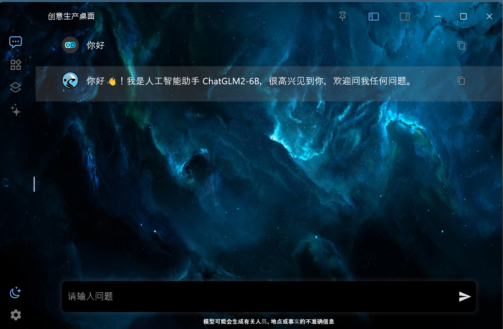
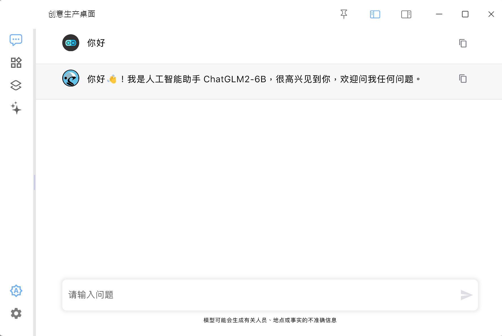

# 创意生产力桌面端

一切为了生产力，尽可能简化复杂的设置，使ai提供高效的生产力
本项目分为桌面应用和服务端两个部分，可单独使用桌面端，也可配合服务端一起使用

[桌面端](https://github.com/ExpanderHx/creative_production_desktop)

无需安装，打开即可使用，多平台适配

[服务端](https://github.com/ExpanderHx/creative_production_serve)
下载服务端之后，进入serve_system目录，启动statr

# creative_production_desktop

Creative production desktop

## Getting Started

This project is a starting point for a Flutter application.

A few resources to get you started if this is your first Flutter project:

- [Lab: Write your first Flutter app](https://docs.flutter.dev/get-started/codelab)
- [Cookbook: Useful Flutter samples](https://docs.flutter.dev/cookbook)

For help getting started with Flutter development, view the
[online documentation](https://docs.flutter.dev/), which offers tutorials,
samples, guidance on mobile development, and a full API reference.
