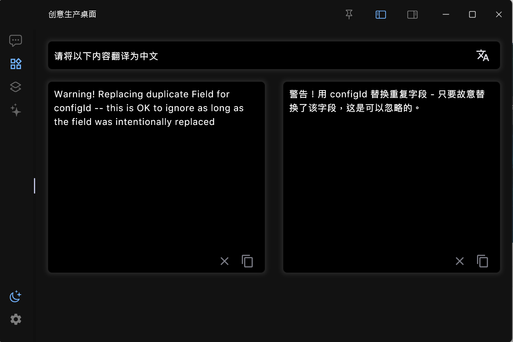
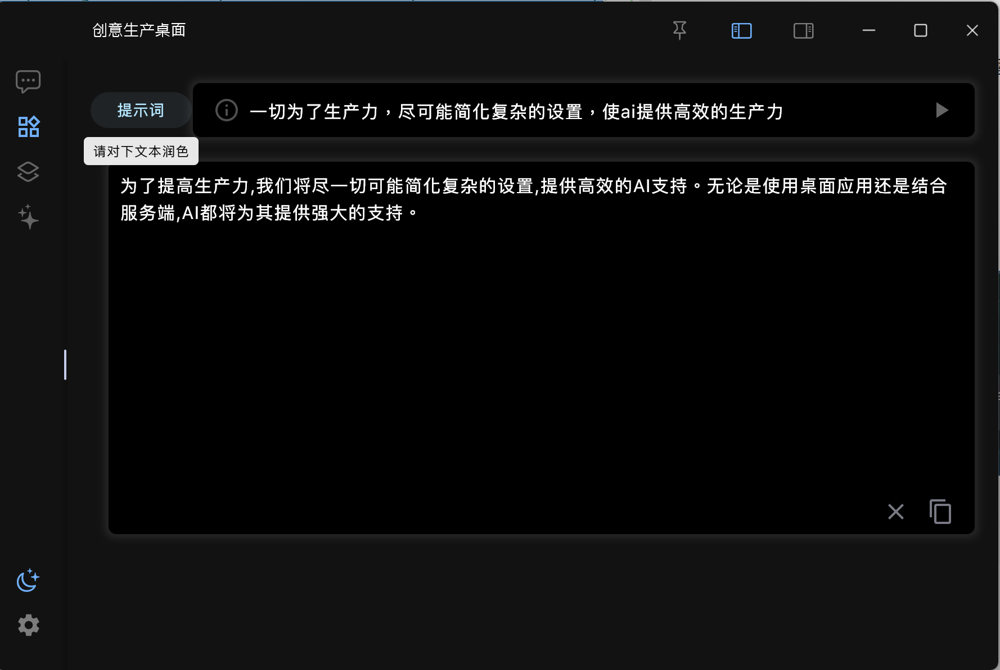

# 创意生产力桌面端

一切为了生产力，尽可能简化复杂的设置，使ai提供高效的生产力
本项目分为桌面应用和服务端两个部分，可单独使用桌面端，也可配合服务端一起使用

#### [桌面端](https://github.com/ExpanderHx/creative_production_desktop)

无需安装，打开即可使用，多平台适配

#### [服务端](https://github.com/ExpanderHx/creative_production_serve)

下载服务端之后，进入serve_system目录，win启动start.bat,linux启动start.sh

#### 聊天界面
打开即可提问聊天

#### 插件功能
自定义快捷键，自定义提示语，即可让ai帮你完成翻译,文章总结，大纲整理，内容解释。只要设置对应提示语，即可创建符合你需要的各种插件

